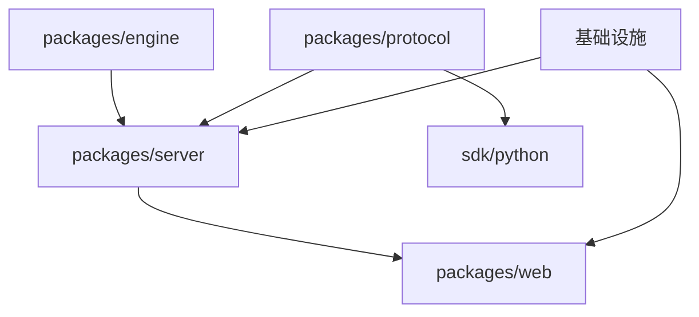

# 异步多 Agent 协作开发方案

## 1. 核心思路

将 Monorepo 的 4 个 packages + SDK + 基础设施拆分为 **6 个独立 Agent 工作流**，按依赖关系分 **3 波** 启动。每个 Agent 负责一个模块，通过预先约定的 **接口契约文件（Interface Contracts）** 解耦，避免文件冲突。

## 2. 依赖关系分析



关键依赖链：
- `engine` 和 `protocol` **互不依赖**，可完全并行
- `server` 依赖 `engine` + `protocol` 的类型导出
- `sdk/python` 仅依赖 `protocol` 的消息格式
- `web` 依赖 `server` 的 REST API

## 3. 三波启动计划

### 🟢 Wave 1 — 完全并行（零依赖）

| Agent | 模块 | 职责 | 预估时间 |
|-------|------|------|---------|
| **Agent A** | `packages/engine` | 游戏引擎核心 + Texas Hold'em 插件 | 5-7 天 |
| **Agent B** | `packages/protocol` | 协议消息类型 + JSON Schema + Codec | 2-3 天 |
| **Agent C** | 基础设施 | Monorepo 脚手架 + Docker + DB + CI/CD | 2-3 天 |

> Wave 1 三个 Agent **完全独立工作，零文件冲突**。

---

### 🟡 Wave 2 — 依赖 Wave 1 接口

| Agent | 模块 | 职责 | 前置条件 | 预估时间 |
|-------|------|------|---------|---------|
| **Agent D** | `packages/server` | 后端服务（Fastify + WS + 业务逻辑） | engine 类型 + protocol 类型 + DB schema | 5-7 天 |
| **Agent E** | `sdk/python` | Python SDK + 示例 Agent + 沙盒 | protocol 消息格式 | 3-4 天 |

> Wave 2 可在 Wave 1 的 **接口契约** 确定后立即启动，无需等 Wave 1 全部完成。

---

### 🔵 Wave 3 — 依赖 Wave 2 API

| Agent | 模块 | 职责 | 前置条件 | 预估时间 |
|-------|------|------|---------|---------|
| **Agent F** | `packages/web` | 前端（Next.js 排行榜 + 观赛 + 回放） | server REST API 定义 | 4-5 天 |

---

## 4. 各 Agent 详细职责与文件边界

### Agent A — 游戏引擎 (`packages/engine/`)

**文件所有权**：
```
packages/engine/
├── src/
│   ├── core/
│   │   ├── engine-core.ts        # EngineCore 类
│   │   ├── view-layer.ts         # ViewLayer 信息集过滤
│   │   └── rng.ts                # 确定性随机数生成器
│   ├── plugins/
│   │   └── texas-holdem-hu/
│   │       ├── state.ts          # TexasHoldemState 类型
│   │       ├── actions.ts        # TexasHoldemAction 类型
│   │       ├── plugin.ts         # applyAction, getLegalActions, etc.
│   │       └── hand-evaluator.ts # 手牌评估器
│   └── types/
│       ├── game-plugin.ts        # GamePlugin 接口 ⭐ 契约文件
│       ├── game-state.ts         # GameState 基础类型 ⭐ 契约文件
│       └── index.ts              # 统一导出
├── tests/
└── package.json
```

**关键输出**（供 Agent D 使用）：
- `GamePlugin` 接口定义
- `TexasHoldemState`, `TexasHoldemAction` 类型
- `EngineCore` 和 `ViewLayer` 的公共 API

**参考文档**：
- [ARCHITECTURE.md](file:///Users/lyf/Documents/projects-shared/carbon-silicon-arena/ARCHITECTURE.md) §4.2.1-4.2.2（引擎和 View Layer 接口伪代码）
- [games/texas_holdem.md](file:///Users/lyf/Documents/projects-shared/carbon-silicon-arena/games/texas_holdem.md)（状态机定义 §3, 信息集 §4）
- [TASK_PLAN.md](file:///Users/lyf/Documents/projects-shared/carbon-silicon-arena/TASK_PLAN.md) Epic 2

---

### Agent B — 协议层 (`packages/protocol/`)

**文件所有权**：
```
packages/protocol/
├── src/
│   ├── schemas/                  # JSON Schema 文件
│   │   ├── client-hello.json
│   │   ├── game-action.json
│   │   ├── ... (每种消息一个 schema)
│   │   └── index.ts
│   ├── messages/                 # TypeScript 消息类型定义
│   │   ├── envelope.ts           # 消息信封 ⭐ 契约文件
│   │   ├── auth.ts               # ClientHello, ServerHello
│   │   ├── matchmaking.ts        # JoinQueue, MatchFound, etc.
│   │   ├── room.ts               # CreateRoom, JoinRoom, etc.
│   │   ├── game.ts               # GameState, ActionRequest, GameAction
│   │   ├── observer.ts           # Observer 消息
│   │   ├── error.ts              # 错误码定义
│   │   └── index.ts              # 统一导出 ⭐ 契约文件
│   ├── codec.ts                  # 编解码 + Schema 校验
│   └── sequence.ts               # Sequence ID 管理
├── tests/
└── package.json
```

**关键输出**（供 Agent D, E 使用）：
- 所有消息的 TypeScript 类型定义
- JSON Schema 文件
- `encode()` / `decode()` 函数

**参考文档**：
- [ARENA_PROTOCOL.md](file:///Users/lyf/Documents/projects-shared/carbon-silicon-arena/ARENA_PROTOCOL.md)（全部 22 种消息的 payload 定义）
- [TASK_PLAN.md](file:///Users/lyf/Documents/projects-shared/carbon-silicon-arena/TASK_PLAN.md) Epic 3

---

### Agent C — 基础设施

**文件所有权**：
```
carbon-silicon-arena/
├── package.json                  # Monorepo root
├── pnpm-workspace.yaml
├── tsconfig.base.json
├── .eslintrc.js
├── .prettierrc
├── vitest.config.ts
├── docker-compose.yml
├── .github/
│   └── workflows/
│       └── ci.yml
├── nginx/
│   └── arena.conf
├── scripts/
│   ├── register-baseline-bots.js
│   └── db-migrate.sh
└── packages/server/src/db/       # 仅 DB 迁移文件
    ├── migrations/
    └── schema.prisma (或 drizzle schema)
```

**关键输出**（供所有 Agent 使用）：
- `tsconfig.base.json`（TypeScript 基础配置）
- `pnpm-workspace.yaml`（workspace 定义）
- DB migration 文件

**参考文档**：
- [ARCHITECTURE.md](file:///Users/lyf/Documents/projects-shared/carbon-silicon-arena/ARCHITECTURE.md) §3, §5（技术栈 + 部署）
- [DATABASE_SCHEMA.md](file:///Users/lyf/Documents/projects-shared/carbon-silicon-arena/DATABASE_SCHEMA.md)（完整 schema）
- [DEPLOYMENT.md](file:///Users/lyf/Documents/projects-shared/carbon-silicon-arena/DEPLOYMENT.md)（Docker + Nginx 配置）
- [CONTRIBUTING.md](file:///Users/lyf/Documents/projects-shared/carbon-silicon-arena/CONTRIBUTING.md)（ESLint/Prettier 规则）
- [TASK_PLAN.md](file:///Users/lyf/Documents/projects-shared/carbon-silicon-arena/TASK_PLAN.md) Epic 1

---

### Agent D — 后端服务 (`packages/server/`)

**文件所有权**：
```
packages/server/
├── src/
│   ├── app.ts                    # Fastify 入口
│   ├── handlers/
│   │   ├── auth-handler.ts
│   │   ├── message-router.ts
│   │   └── version-negotiator.ts
│   ├── services/
│   │   ├── matchmaker.ts
│   │   ├── room-manager.ts
│   │   ├── game-session.ts
│   │   ├── rating.ts
│   │   └── reconnection.ts
│   ├── bots/
│   │   ├── random-bot.ts
│   │   ├── rule-bot.ts
│   │   └── cfr-bot.ts
│   ├── routes/                   # REST API
│   │   ├── leaderboard.ts
│   │   ├── matches.ts
│   │   └── agents.ts
│   ├── ws/
│   │   ├── agent-ws.ts           # Agent WebSocket 端点
│   │   └── observer-ws.ts        # Observer WebSocket 端点
│   └── logger/
│       └── jsonl-writer.ts
├── tests/
└── package.json
```

**输入依赖**：
- 从 `@carbon-arena/engine` 导入 `EngineCore`, `ViewLayer`, `TexasHoldemPlugin`
- 从 `@carbon-arena/protocol` 导入所有消息类型, `encode`, `decode`
- 从 DB schema 导入表结构

**关键输出**（供 Agent F 使用）：
- REST API 端点（[API_REFERENCE.md](file:///Users/lyf/Documents/projects-shared/carbon-silicon-arena/API_REFERENCE.md) 已完整定义）

**参考文档**：
- [API_REFERENCE.md](file:///Users/lyf/Documents/projects-shared/carbon-silicon-arena/API_REFERENCE.md)（REST API schema）
- [ARENA_PROTOCOL.md](file:///Users/lyf/Documents/projects-shared/carbon-silicon-arena/ARENA_PROTOCOL.md)（WebSocket 协议）
- [TASK_PLAN.md](file:///Users/lyf/Documents/projects-shared/carbon-silicon-arena/TASK_PLAN.md) Epic 4, 5

---

### Agent E — Python SDK (`sdk/python/`)

**文件所有权**：
```
sdk/python/
├── carbon_arena/
│   ├── __init__.py
│   ├── client.py                 # WebSocket 连接管理
│   ├── agent.py                  # BaseAgent 基类
│   ├── models.py                 # GameState, Action, HandResult 等
│   ├── codec.py                  # 消息序列化/反序列化
│   └── cli.py                    # carbon-arena sandbox 命令
├── examples/
│   ├── random_agent.py
│   └── simple_rule_agent.py
├── tests/
├── setup.py
└── README.md
```

**输入依赖**：
- `packages/protocol` 的消息格式（TypeScript 类型 → Python dataclass 等价映射）

**参考文档**：
- [SDK_GUIDE.md](file:///Users/lyf/Documents/projects-shared/carbon-silicon-arena/SDK_GUIDE.md)（API 设计参考）
- [ARENA_PROTOCOL.md](file:///Users/lyf/Documents/projects-shared/carbon-silicon-arena/ARENA_PROTOCOL.md)（消息格式）
- [TASK_PLAN.md](file:///Users/lyf/Documents/projects-shared/carbon-silicon-arena/TASK_PLAN.md) Epic 7

---

### Agent F — 前端 (`packages/web/`)

**文件所有权**：
```
packages/web/
├── src/
│   ├── app/
│   │   ├── page.tsx              # 首页
│   │   ├── leaderboard/page.tsx
│   │   ├── matches/
│   │   │   ├── page.tsx          # 对局列表
│   │   │   └── [id]/page.tsx     # 对局详情
│   │   ├── replay/[id]/page.tsx  # 回放
│   │   ├── observe/page.tsx      # 观赛
│   │   └── register/page.tsx     # Agent 注册
│   ├── components/
│   └── lib/
├── public/
└── package.json
```

**输入依赖**：
- [API_REFERENCE.md](file:///Users/lyf/Documents/projects-shared/carbon-silicon-arena/API_REFERENCE.md) 定义的 REST API 格式
- [ARENA_PROTOCOL.md](file:///Users/lyf/Documents/projects-shared/carbon-silicon-arena/ARENA_PROTOCOL.md) 的 Observer WebSocket 消息

**参考文档**：
- [API_REFERENCE.md](file:///Users/lyf/Documents/projects-shared/carbon-silicon-arena/API_REFERENCE.md)
- [ARENA_PROTOCOL.md](file:///Users/lyf/Documents/projects-shared/carbon-silicon-arena/ARENA_PROTOCOL.md) §9（Observer 协议）
- [TASK_PLAN.md](file:///Users/lyf/Documents/projects-shared/carbon-silicon-arena/TASK_PLAN.md) Epic 6

---

## 5. 接口契约（Interface Contracts）

> **核心原则**：在 Wave 1 启动前，先由一个 Agent（或人工）创建"接口契约文件"。后续 Agent 从这些文件导入类型，而非直接依赖其他 Agent 的实现。

### 5.1 需要预先创建的契约文件

| 契约文件 | 内容 | 由谁创建 |
|---------|------|---------|
| `packages/engine/src/types/game-plugin.ts` | `GamePlugin` 接口定义 | Agent A 首要产出 |
| `packages/engine/src/types/game-state.ts` | `GameState`, `GameAction` 基础类型 | Agent A 首要产出 |
| `packages/protocol/src/messages/index.ts` | 所有消息的 TypeScript 类型统一导出 | Agent B 首要产出 |
| `packages/protocol/src/codec.ts` | `encode()`, `decode()` 函数签名 | Agent B 首要产出 |

### 5.2 契约优先原则

每个 Agent 的 **第一个 commit** 应该是其导出的接口/类型定义（`.d.ts` 级别），而非完整实现。这样 Wave 2 的 Agent 可以：
1. 在 Wave 1 Agent 完成接口定义后立即开始工作
2. 基于类型定义编译通过，即使实现尚未完成
3. 用 mock/stub 替代尚未完成的实现进行本地测试

---

## 6. 冲突避免规则

| 规则 | 说明 |
|------|------|
| **文件所有权独占** | 每个文件只属于一个 Agent，其他 Agent 只能 import 不能修改 |
| **不碰根 package.json** | 只有 Agent C 可以修改根目录的 `package.json` 和 `pnpm-workspace.yaml` |
| **子包独立 package.json** | 每个 Agent 独立管理自己包的 `package.json`，Agent C 不碰子包的 |
| **DB schema 单一所有者** | 只有 Agent C 写 migration 文件，Agent D 只读不写 |
| **不碰文档** | 所有 Agent 不修改 [.md](file:///Users/lyf/Documents/projects-shared/carbon-silicon-arena/PRD.md) 文档文件，文档变更需单独协调 |

---

## 7. 给每个 Agent 的启动 Prompt 模板

### Wave 1 Agent 通用前缀

```
你正在参与碳硅竞技场 (Carbon-Silicon Arena) 的多 Agent 协作开发。

项目使用 pnpm monorepo，包含 4 个 TypeScript 子包：
packages/engine, packages/protocol, packages/server, packages/web
以及 sdk/python。

你的职责是 **仅负责** [你的模块] 目录下的所有文件。
你 **不得修改** 其他模块的任何文件。

在完成实现前，请 **优先产出** 你模块的类型定义和接口（导出的 .ts 类型文件），
以便并行工作的其他 Agent 可以尽早引用。

## 必读文档
[列出该 Agent 应读取的文档列表]

## 参考设计
[引用具体的架构文档章节和游戏设计文档]
```

### Agent A 具体 Prompt

```
你负责 packages/engine/ — 游戏引擎核心。

你的任务：
1. 先创建 `src/types/game-plugin.ts` 导出 GamePlugin 接口
   （参考 ARCHITECTURE.md §4.2.1 的伪代码）
2. 实现 EngineCore 类（状态管理、动作应用、终止判定）
3. 实现 ViewLayer 类（filterForPlayer、filterForObserver）
4. 实现确定性 RNG（基于 seed）
5. 实现 Texas Hold'em Heads-Up 插件（状态机、手牌评估器）
6. 编写测试（覆盖率目标 >95%）

必读文档：ARCHITECTURE.md, games/texas_holdem.md, TASK_PLAN.md (Epic 2)
```

### Agent B 具体 Prompt

```
你负责 packages/protocol/ — Arena-Protocol 消息和编解码。

你的任务：
1. 先创建 `src/messages/index.ts` 导出所有消息的 TypeScript 类型
   （对照 ARENA_PROTOCOL.md 的 22 种消息逐一定义）
2. 为每种入站消息编写 JSON Schema（src/schemas/）
3. 实现 codec.ts（encode/decode + schema 校验）
4. 实现 sequence.ts（Sequence ID 管理 + 消息缓冲区）
5. 编写测试

必读文档：ARENA_PROTOCOL.md（完整协议规范）, TASK_PLAN.md (Epic 3)
```

### Agent C 具体 Prompt

```
你负责项目基础设施搭建。

你的任务：
1. 初始化 pnpm workspace monorepo
2. 创建 4 个子包的骨架目录和 package.json
3. 配置 tsconfig.base.json + 各包继承
4. 配置 ESLint + Prettier（参考 CONTRIBUTING.md）
5. 配置 Vitest
6. 编写 docker-compose.yml + Dockerfile
7. 配置 Nginx（参考 DEPLOYMENT.md）
8. 创建 PostgreSQL schema + migration
   （参考 DATABASE_SCHEMA.md 的完整 SQL）
9. 配置 Redis 连接
10. 配置 GitHub Actions CI

必读文档：ARCHITECTURE.md, DATABASE_SCHEMA.md, DEPLOYMENT.md, 
         CONTRIBUTING.md, TASK_PLAN.md (Epic 1)

注意：你只负责脚手架和基础设施，不要写业务逻辑代码！
各子包的 src/ 目录留空，由对应的 Agent 填充。
```

---

## 8. 时间线

```
Day 0 ─── 人工创建空 monorepo + git init
          │
Day 1-3 ─ Wave 1 启动（A + B + C 并行）
          │  Agent C: 脚手架 + DB + Docker (Day 1-2 完成)
          │  Agent B: 协议类型定义 (Day 1 导出接口, Day 2-3 实现)
          │  Agent A: 引擎接口 + FSM (Day 1 导出接口, Day 2-5 实现)
          │
Day 2-3 ─ Wave 2 可启动（B 接口就绪后）
          │  Agent E: Python SDK (Day 2-5)
          │
Day 3-5 ─ Wave 2 全面启动（A + B 接口就绪后）
          │  Agent D: 后端服务 (Day 3-9)
          │
Day 7-9 ─ Wave 3 启动（D REST API 就绪后）
          │  Agent F: 前端 (Day 7-12)
          │
Day 10-12 ── 集成测试 + 端到端验证
```

> **乐观估计**：同步并行可将 4-6 周单人工期压缩至 **10-12 天**。

---

## 9. 集成检查点

| 检查点 | 触发条件 | 验证内容 |
|--------|---------|---------|
| **CP1** | Wave 1 全部完成 | engine + protocol 类型互相兼容，Docker 环境可启动 |
| **CP2** | Agent D 完成 Auth + WS 骨架 | SDK Agent 可连接并完成握手 |
| **CP3** | Agent D 完成 Game Session | 两个 Bot 可完成一局完整对局 |
| **CP4** | Agent F 完成排行榜页 | 前端可调用 REST API 展示数据 |
| **CP5** | 全部完成 | 端到端：SDK Agent → WS → 后端 → 引擎 → 结果返回 → 前端展示 |
